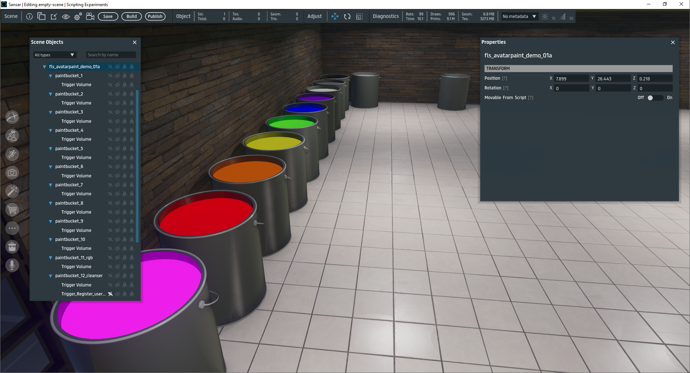
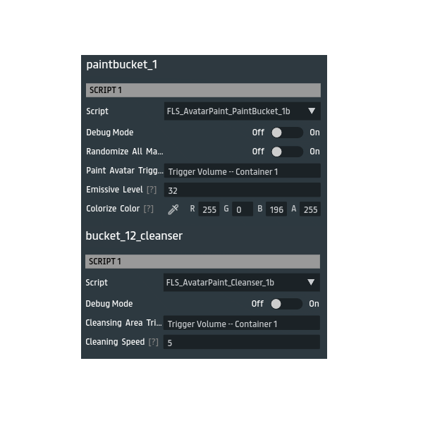

# AvatarPaint - Sansar Scripting Demo

This repository provides a Sansar scripting demo, "AvatarPaint" aka "PaintBucket", which allows avatars to appear painted with a specific color or be randomly colorized on a per-material basis. This effect is triggered by avatar interactions with designated trigger volumes, and avatars can be "cleansed" of the effect in a separate cleansing area. The demo provides two main scripts:

1. **FLS_AvatarPaint_PaintBucket_1b.cs** - Applies a color or random tint to avatars when they enter a paint trigger volume.
2. **FLS_AvatarPaint_Cleanser_1b.cs** - Restores avatars' original material properties when they enter the cleansing area trigger volume.

### Repository

- **Repository Name:** [sansar-avatarpaint](https://github.com/iamfreelight/sansar-avatarpaint)

## Scripts Overview

### FLS_AvatarPaint_PaintBucket_1b.cs
This script applies color or random tint to avatars upon entering the specified paint trigger volume.

- **Features**:
  - `Randomize All Materials` (toggle): If enabled, each avatar material is tinted a different random color.
  - `Colorize Color`: When randomization is off, applies a uniform color to all avatar materials.
  - `Emissive Level`: Adjusts the emissive intensity of the applied colors.

### FLS_AvatarPaint_Cleanser_1b.cs
This script restores avatars' original colors and emissive properties when they enter the cleansing area trigger volume.

- **Features**:
  - `rbTriggerSpawnpoint`: Tracks each avatar’s original material properties when they enter the scene or designated area
  - `rbTriggerCleanserArea`: Restores avatars' original colors and emissive values upon entry.
  - `Cleansing Speed`: Controls the duration for which the cleansing effect fades in.
  - Maintains a record of each avatar’s original materials properties to enable restoration.

## How to Use
1. Set up trigger volumes in your scene.
   - **Paint Trigger Volumes**: Assign `FLS_AvatarPaint_PaintBucket_1b` to objects in the scene, and slot in a TriggerVolume for each, where avatars can get "painted" the colors you select on each script with various settings
   - **Cleansing Trigger Volumes**: Assign `FLS_AvatarPaint_Cleanser_1b` to a designated "rinse" area object, then Copy/Paste Reference (slot in) a TriggerVolume for the rbTriggerCleanserArea on this script;  Also slot in a TriggerVolume entry for rbTriggerSpawnPoint that takes up the entire painting area, scene, or on the spawnpoint of the scene about the size of an avatar -- my personal preference is the entire painting area or the entire scene.

-> That's pretty much it!

## Demo
A pre-configured demo is available for free download on the Sansar store: [AvatarPaint Demo](https://store.sansar.com/listings/f2c39206-18d1-4379-a84f-ba9d220a9ae8/avatarpaint-demo-v01b).
This demo is also setup in my Sansar world '[Scripting Experiments](https://atlas.sansar.com/experiences/freelight-1030/empty)'
