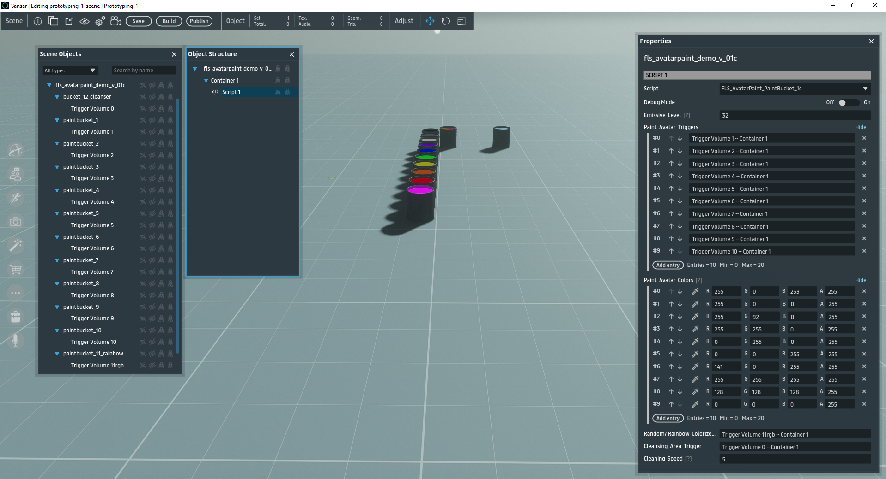
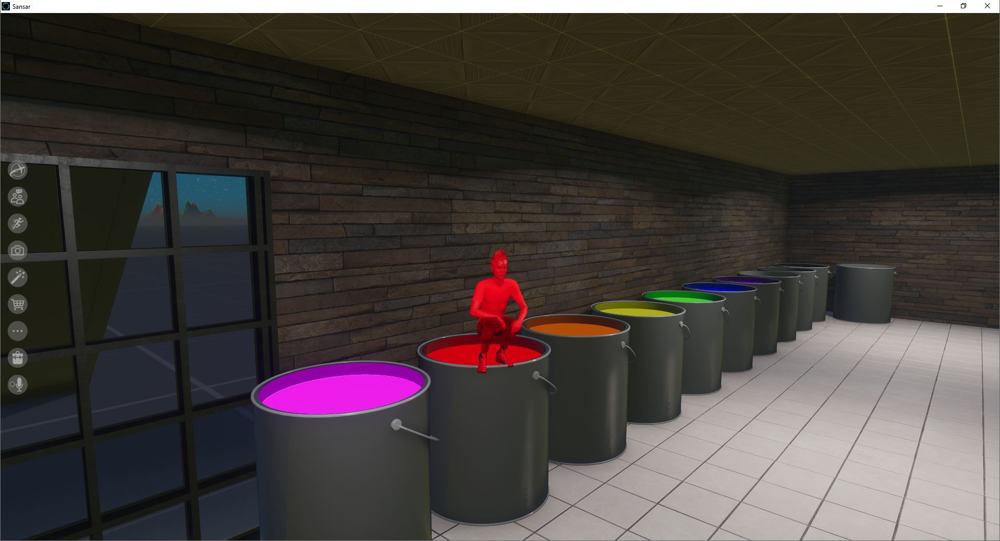
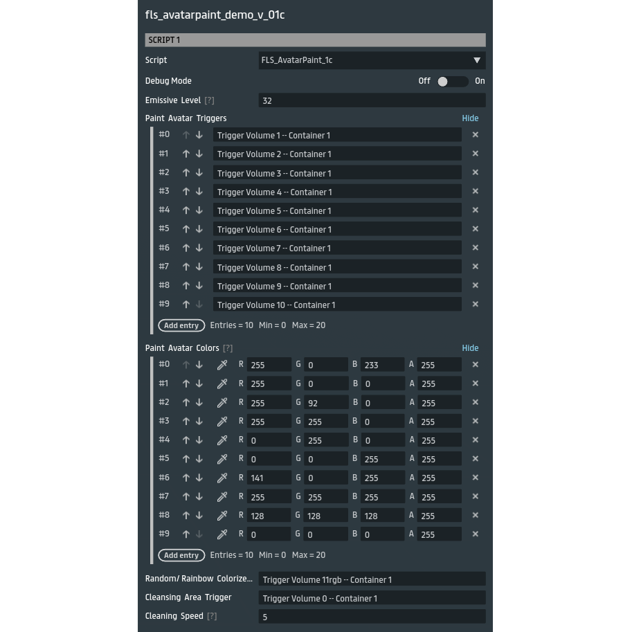

# AvatarPaint - Sansar Scripting Demo

This repository provides a Sansar scripting demo, "AvatarPaint", which allows avatars to appear painted with a specific color or be randomly colorized on a per-material basis. This effect is triggered by avatar interactions with designated trigger volumes, and avatars can be "cleansed" of the effect in a separate cleansing area. The demo works out of one single script:

## Scripts Overview

### FLS_AvatarPaint_1c.cs
This script applies color or random tint to avatars upon entering the specified paint trigger volumes, or random colors per material when entering the RgbTrigger.  The script also script restores avatars' original colors and emissive properties when they enter the cleansing area trigger volume.

- **Features**:
  - `RgbTrigger` (Trigger): If slotted, each avatar material is tinted a different random color when entering this trigger.
  - `Emissive Level`: Adjusts the emissive intensity of the applied colors.
  - `CleanserAreaTrigger`: Restores avatars' original colors and emissive values upon entry.
  - `Cleansing Speed`: Controls the duration for which the cleansing effect fades in.
  - Maintains a record of each avatar’s original materials properties to enable restoration.

## How to Use
1. Set up trigger volumes in your scene, attach them to  the script, and pick colors for each one
   - **Paint Trigger Volumes**: Assign `FLS_AvatarPaint_1c` script to the group of your trigger/bucket objects in the scene, and slot them into the 'Paint Avatar Triggers' list, next define the same number of entries in the 'Paint Avatar Colors'   list and define a color for each, the entry # on each list allows each color entry to correspond with each TriggerVolume
   - **RgbTrigger**: Copy/Paste a reference (slot in) a TriggerVolume if you want one to do a rainbow (random color per material) effect to the avatar when this trigger is entered
   - **Cleansing Trigger Volume**: Copy/Paste a reference (slot in) a TriggerVolume for the CleanserAreaTrigger on this script, this trigger allows the user to be 'cleansed' of the colorized tint effect on their avatar

-> That's pretty much it!

## Demo
A pre-configured demo is available for free download on the Sansar store: [AvatarPaint Demo](https://store.sansar.com/listings/2c37a349-cb01-413b-a962-b1b4f765a0df/fls-avatarpaint-demo-v01c).
This demo is also setup in my Sansar world '[Scripting Experiments](https://atlas.sansar.com/experiences/freelight-1030/empty)'
